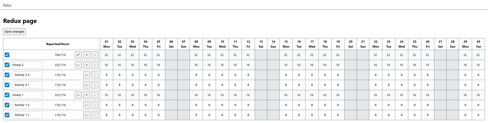

# State manager examples

## Repository description

This repository contains variations of the same SPA (single-page application) built with different state managers to demonstrate their capabilities.

## Application description



The application is a working hours timesheet (a table). It has the following relationship structure:

- Groups - groups of activities
  - Activities - summary of a work (for example, "Work on ticket XYZ")
    - Worklogs - a record of hours spent on the activity on a day

Each day has a reporting norm (8 for working days and 0 for weekends). Edit in worklog cells for days with 0 norm is disabled.

The table has the following rows:

- Header
- Summary - contains reporting summary for all worklogs
- Group (multiple)
- Activity (within a group) (multiple)

The table has two types of columns - info and date.
Info columns contain:

- Row-related controls
- Row-related reported hours' duration vs. norm statistics

Date columns contain:

- Date-related reported hours' duration for the summary and group rows
- Worklog inputs or placeholder cells in activity rows

User can:

- Add a group ("+" button). Groups are added at the top of the table
- Remove a group ("-" button). Also removes its activities and worklogs
- Change a group's name (text input)
- Add an activity ("+" button). Activities are added at the top of the group
- Remove an activity ("-" button). Also removes its worklogs
- Change an activity's name (text input)
- Add/remove/change worklog in non-disabled cells in activity row (text inputs)
- Select worklogs in an activity, group, or all (checkboxes)
- Move selected worklogs to a group or an activity ("←" button)
- Add multiple groups, activities, and worklogs at once ("++" button) (for testing purposes)
- Remove all groups, activities, and worklogs at once ("-" button)
- Save changes to Local Storage ("Save changes" button). Disabled when there are no worklogs

Additional features:

- When there are several groups with the same name (or several activities within a group), a duplicate name indicator ("!") appears near such groups'/activities' name inputs
- Groups and activities always have non-empty names. If the value in the group's/activity's input is cleated and the input loses focus, the last saved name is set to the input
- When groups and activities are added, their names follow a pattern "Group/Activity {index}". If `index` is 0, it is not added to the name. If there already is a group/activity with the same name, the index is increased until a unique name is found
- When data is loaded from Local Storage, or saved to it, a full-page loader is displayed, and all the controls are disabled. These operations have an artificial delay to demonstrate this functionality (controlled by `PAGE_DATA_PROCESSING_DELAY` constant)
- All buttons, the duplicate name indicator and reporting statistics text have a tooltip, that appears when hovering over them or focusing on them via keyboard. They explain what they do, mean or to display information if text on the page is too long that it becomes truncated. The tooltip for reported hours' duration vs. norm statistics also contains a reported-to-norm percentage, which is not displayed in the table (to save space)
- If there are unsaved changes, and a page is about to be closed or reloaded, a prompt with question "Are you sure you want to leave? The unsaved changes will be lost." appears to prevent accidental lose of the changes

## Demonstrated capabilities of state managers

- Initialization/definition
- Single value's update
- Multiple values' update (not computationally expensive)
- Batch update (computationally expensive). It requires not only making multiple values' update in a transaction manner to avoid a lot of unnecessary re-renders, but also accessing the draft data on each iteration during the calculation
- Derived values
- Iteration over values

## State shape

### Common

```ts
type DateString = string;

type Duration = number;

type ActivityId = string;

type ActivityName = string;

type GroupId = string;

type GroupName = string;

type WorklogId = string;

interface Activity {
  groupId: GroupId;
  id: ActivityId;
  name: ActivityName;
}

interface Group {
  id: GroupId;
  name: GroupName;
}

interface Worklog {
  activityId: ActivityId;
  date: DateString;
  duration: Duration;
  groupId: GroupId;
  id: WorklogId;
}

interface CalendarDay {
  date: DateString;
  norm: Duration;
}
```

### Local Storage data

```ts
interface PageData {
  activities: Array<Activity>;
  calendar: Array<CalendarDay>;
  groups: Array<Group>;
  worklogs: Array<Worklog>;
}
```

### Page state

It can be implemented as a single state or multiple ones containing parts of it.

```ts
interface PageState {
  activitiesById: Record<ActivityId, Activity>;
  activityIds: Array<ActivityId>;
  calendar: Array<CalendarDay>;
  groupIds: Array<GroupId>;
  groupsById: Record<GroupId, Group>;
  hasChanges: boolean;
  selectedWorklogIds: Array<WorklogId>;
  worklogIds: Array<WorklogId>;
  worklogsById: Record<WorklogId, Worklog>;
}
```

## Examples

- [React](./react)
  - [Redux](./react/src/pages/redux)
- [Solid](./solid)
  - [Signals](./solid/src/pages/signals)

## License

[MIT](./LICENSE)
